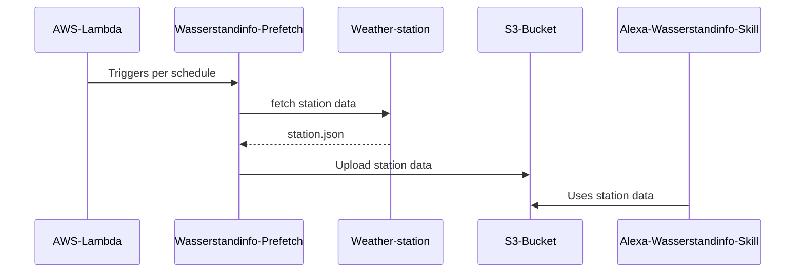
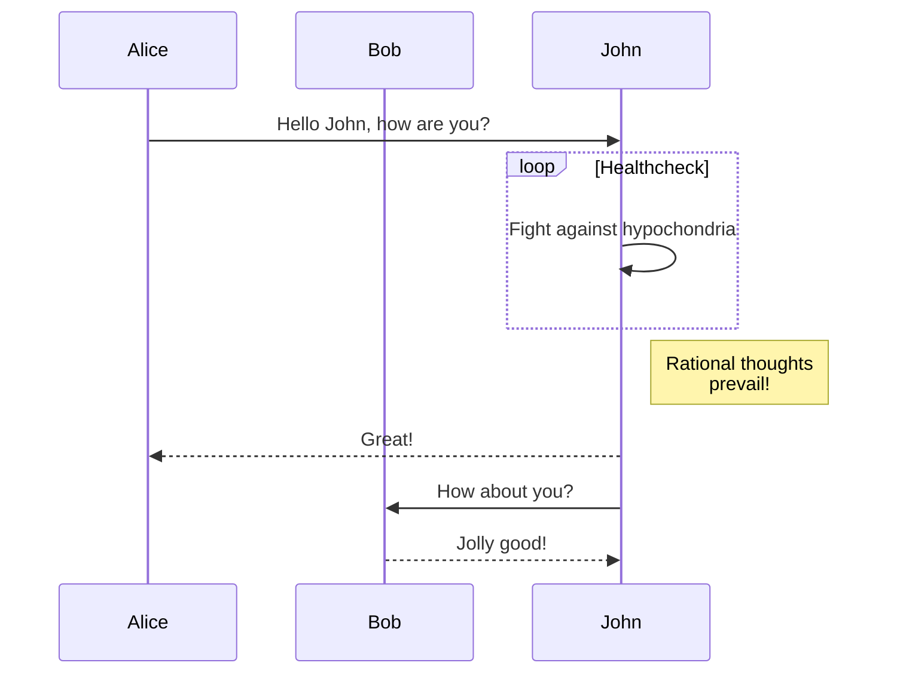

# Wasserstand info prefetch

[](https://www.codacy.com/gh/koenighotze/wasserstandinfo-prefetch/dashboard?utm_source=github.com\&utm_medium=referral\&utm_content=koenighotze/wasserstandinfo-prefetch\&utm_campaign=Badge_Grade)
[](https://github.com/koenighotze/wasserstandinfo-prefetch/actions/workflows/ci.yml)
[](https://www.codacy.com/gh/koenighotze/wasserstandinfo-prefetch/dashboard?utm_source=github.com\&utm_medium=referral\&utm_content=koenighotze/wasserstandinfo-prefetch\&utm_campaign=Badge_Grade)
[](https://www.codacy.com/gh/koenighotze/wasserstandinfo-prefetch/dashboard?utm_source=github.com\&utm_medium=referral\&utm_content=koenighotze/wasserstandinfo-prefetch\&utm_campaign=Badge_Coverage)
[](https://github.com/koenighotze/wasserstandinfo-prefetch/actions/workflows/codeql-analysis.yml)

## Overview

TODO

## Architecture

The following diagram show the link between the different parts of the Wasserstand-prefetch






## Getting started

*   Run ./provision/bootstrap (only needed once)
*   Export the output code-bucket value as BUCKET_NAME
*   Upload code using ./scripts/bundle.sh
*   Run ./provision/function

## Running the integration tests

You need to set the following environment variables:

*   STATIONS_BUCKET_NAME: the name of the bucket
*   STATIONS_OBJECT_KEY_NAME: the name of the object containing the station data
*   LAMBDA_FUNCTION_NAME: the name of the lamba

The values must match the lambda under test. Suppose the lambda is called `wasserstandinfo-prefetch-dev`, you can check the other values with a command like the following:

```bash
$ aws lambda get-function --function-name wasserstandinfo-prefetch-dev | jq '.Configuration.Environment.Variables'
{
  "UPLOAD_BUCKET_NAME": "some-bucket-name",
  "STATIONS_OBJECT_KEY_NAME": "stations.json"
}
```

After you have set the environment variables, run the integration tests

```bash
$ npm run test.integration
...
PASS integration-tests/end-to-end.test.js
  End to end
    ✓ should load the station data into the bucket (3364 ms)

Test Suites: 1 passed, 1 total
Tests:       1 passed, 1 total
Snapshots:   0 total
Time:        4.251 s, estimated 5 s
Ran all test suites.
```
